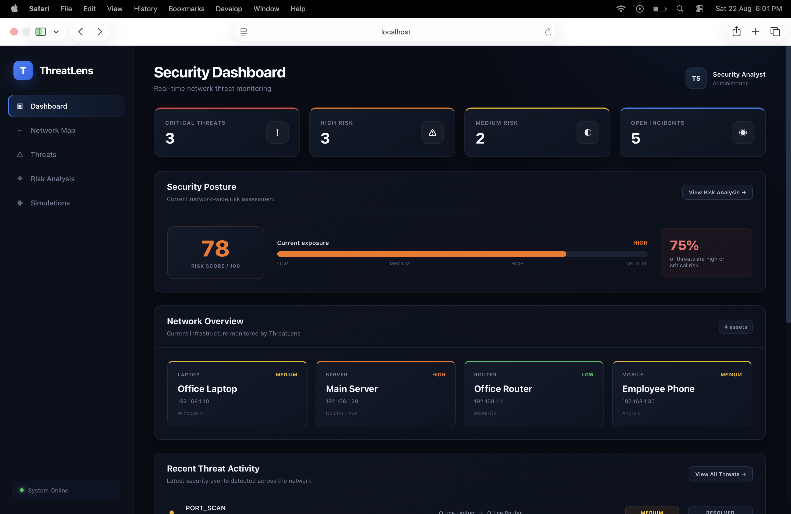
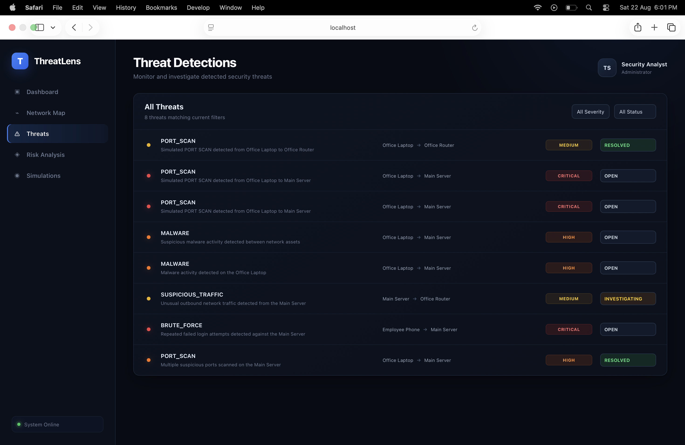
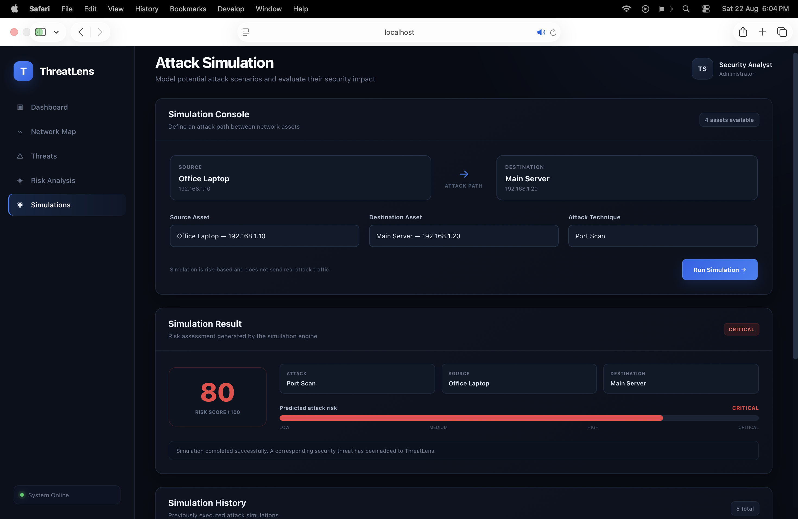

# ThreatLens

A cybersecurity platform for network visualization, threat management, risk analysis, and security simulation.

ThreatLens is a full-stack cybersecurity application designed to provide a centralized view of network assets, detected threats, security risks, and simulated attack scenarios.

The platform combines an interactive React frontend with a Spring Boot backend and PostgreSQL persistence, with JWT-based authentication securing protected API operations.

---

##  Features

### 🔐 Authentication
- User registration and login
- JWT-based authentication
- Protected backend endpoints
- Token-based authorization for API requests

### 🌐 Network Visualization
- Interactive network topology visualization
- Network asset management
- Network connection management
- Visual representation of nodes and connections
- Interactive network map powered by React Flow

### 🛡️ Threat Management
- Threat creation and management
- Threat categorization by type
- Severity classification
- Threat status tracking
- Threat dashboard for monitoring security events

### ⚠️ Risk Analysis
- Security risk assessment
- Risk scoring
- Risk analysis results presented through a dedicated dashboard
- Visualization of security risk information

### 🧪 Security Simulations
- Create and manage network security simulations
- Define simulation parameters
- Execute simulation scenarios
- Store simulation results
- Review simulation outcomes through the frontend

---

##  Screenshots

### Dashboard

### Network Map

### Threat Management

### Risk Analysis

### Security Simulation

---

##  System Architecture

ThreatLens follows a full-stack client-server architecture:

┌─────────────────────────────────────────────┐
│              React Frontend                 │
│                                             │
│  Dashboard │ Network Map │ Threats          │
│  Risk Analysis │ Simulations │ Login        │
└──────────────────────┬──────────────────────┘
                       │
                  REST APIs
                       │
┌──────────────────────▼──────────────────────┐
│            Spring Boot Backend              │
│                                             │
│ Authentication │ Network │ Threats          │
│ Risk Analysis │ Simulations │ Security      │
└──────────────────────┬──────────────────────┘
                       │
                  Spring Data JPA
                       │
┌──────────────────────▼──────────────────────┐
│               PostgreSQL                    │
│                                             │
│ Users │ Network Assets │ Connections        │
│ Threats │ Simulations                       │
└─────────────────────────────────────────────┘
---                              
                       
#  Author                                      

**Nayna Sharma**                               

B.Tech Computer Science Engineering            

MIT World Peace University
